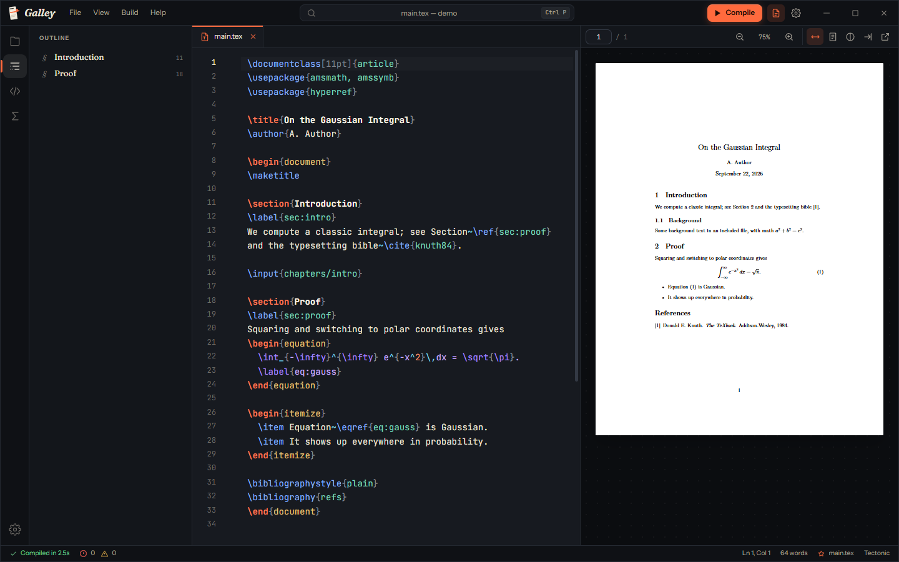

<p align="center"></p>

# Galley

A modern LaTeX editor for Windows: file explorer, a live PDF preview that follows your typing,
SyncTeX jumps between source and PDF, 60+ snippets, a math symbol palette and a settings window
for everything from themes to the LaTeX engine.

*A galley proof is the long sheet of freshly set type that compositors pulled for proofreading
before a page went to press — write, check the proof, correct, repeat.*

**[Download the latest release](https://github.com/ocauapaz/galley/releases/latest)** — `Galley.exe`, no installer.



## Getting started

1. Run `Galley.exe` (no installer; needs the WebView2 runtime that ships with Windows 11).
2. **New project** → pick a template (Article, Report, Presentation, Letter, Blank), or **Open folder**.
3. Press **Ctrl+Enter** to compile. The first compile downloads the Tectonic engine (~30 MB) and
   the LaTeX packages your document uses; after that, compiles take a second or two.

With **Live preview** on (default) the PDF refreshes shortly after you stop typing.

## Features

| Area | What you get |
| --- | --- |
| Editor | LaTeX highlighting (commands, environments, math, labels), bracket matching, folding, multi-cursor, find/replace, spell check (optional) |
| Completion | Commands after `\`, environments after `\begin{`, labels after `\ref{`, BibTeX keys after `\cite{`, project files after `\input{` / `\includegraphics{` |
| Snippets | 70+ built-in (sections, figures, tables, equations, matrices, TikZ, Beamer…). Type a trigger and press **Tab** (`fig`, `eq`, `tab`, `item`…), click one in the Snippets panel, or define your own in Settings › Snippets |
| Symbols | Clickable palette of Greek letters, operators, relations, arrows, sets and accents |
| PDF preview | Live reload without losing your place, zoom (Ctrl+wheel), fit width/page, dark pages, open in external viewer |
| SyncTeX | **Double-click** the PDF to jump to the source line (also into `\input` files); **Ctrl+Alt+J** shows the cursor position in the PDF |
| Problems | Errors and warnings from the log, clickable, underlined in the editor |
| Explorer | Tree with keyboard navigation, new/rename/delete (to the Recycle Bin), set main file, reveal in File Explorer |
| Outline | Sections, chapters and Beamer frames of the current file; follows the cursor |
| Command palette | **Ctrl+Shift+P** for every action, **Ctrl+P** to open files |

## Which file gets compiled

1. A magic comment at the top of the current file: `% !TEX root = main.tex`
2. The project's main file (right-click a `.tex` › *Set as main file*, or click the ★ in the status bar)
3. The current file if it has `\documentclass`
4. The first `.tex` file with `\documentclass` found in the folder

## Engines

Settings › Compilation. **Tectonic** (default) needs nothing installed. **latexmk**, **pdfLaTeX**,
**XeLaTeX** and **LuaLaTeX** use MiKTeX or TeX Live from `PATH`, or an explicit executable path.

## Customisation

Settings (**Ctrl+,**): 8 themes (including two high-contrast ones), accent color, interface size,
density, reduced motion, editor font/size/line height/ligatures/indent, word wrap, line numbers,
auto-close brackets, suggestions, snippet Tab triggers, compile on save, live preview delay,
PDF zoom and dark pages, auto save, hidden files, session restore.

Everything is stored in `%APPDATA%\Galley\settings.json`; Tectonic lives in `%APPDATA%\Galley\bin`.

## Accessibility

Full keyboard operation (tree, tabs, menus, palette, panel resizers with arrow keys), visible focus
rings, ARIA roles on all widgets, high-contrast themes, UI scaling up to 160 %, and animations that
respect Windows' *reduce motion* setting.

## Building from source

Requirements: Node 20+, Rust (MSVC toolchain), Visual Studio Build Tools.

```
npm install
npm test               # parser unit tests
npx tauri dev          # run with hot reload
build.bat              # release exe + zip in build\
```
